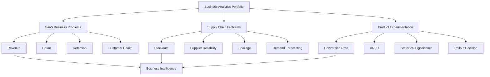
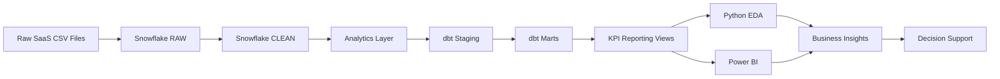
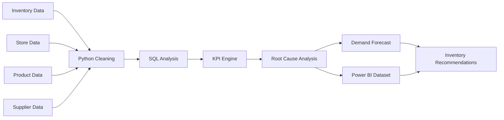
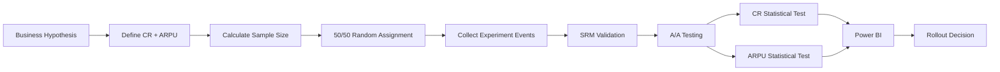

<div align="center">

# 📊 SHIL GAWANDE

## Analytics Project Portfolio

### Data Analytics • Business Intelligence • Product Analytics • Supply Chain Analytics

**Turning business problems into data-driven decisions using SQL, Python, Power BI, Snowflake and dbt**

[](https://github.com/gawandeshil03-ops)
[](#-featured-projects)

</div>

---

# 👋 Portfolio Overview

This portfolio presents three end-to-end analytics projects covering different business domains:

* ☁️ **SaaS Business & IT Operations Analytics**
* 🚚 **SupplyIQ — Supply Chain Analytics**
* 🧪 **A/B Testing for Marketing**

The projects demonstrate the complete analytical workflow:

```text
Business Problem
       ↓
Data Collection
       ↓
Data Cleaning & Validation
       ↓
SQL / Python Analysis
       ↓
Data Modeling
       ↓
Business KPIs
       ↓
Power BI / Visualization
       ↓
Insights
       ↓
Business Decision
```

---

# 🧭 Explore Projects

| #  | Project                                        | Focus                                        | Repository                                                                             |
| -- | ---------------------------------------------- | -------------------------------------------- | -------------------------------------------------------------------------------------- |
| 01 | ☁️ **SaaS Business & IT Operations Analytics** | Revenue, Churn, Retention, Customer Health   | [Explore ↓](#01--️-saas-business--it-operations-analytics)                             |
| 02 | 🚚 **SupplyIQ — Supply Chain Analytics**       | Inventory, Suppliers, Stockouts, Forecasting | [Open Project →](https://github.com/gawandeshil03-ops/SupplyIQ-Supply-Chain-Analytics) |
| 03 | 🧪 **A/B Testing for Marketing**               | Experimentation, Conversion, ARPU            | [Open Project →](https://github.com/gawandeshil03-ops/AB-Testing-for-Marketing)        |

---

# 🔄 Portfolio Architecture



---

# 🚀 Featured Projects

# 01 | ☁️ SaaS Business & IT Operations Analytics

> **Enterprise analytics engineering and business intelligence platform for SaaS revenue, subscriptions, churn, retention, product usage, support operations and customer health.**

### 🔴 Problem

A SaaS business needs a reliable analytical system to understand:

* Which plans generate the most recurring revenue
* How MRR and ARR change
* Which customers are likely to churn
* Which signup cohorts retain best
* Whether product usage affects retention
* Whether support burden correlates with churn
* Which accounts require intervention

### 🟢 Solved

Built a multi-layer analytics architecture transforming raw SaaS data into business-ready analytical models and KPI reporting.

### 🏗️ Architecture



### 📊 Analytics Covered

**Revenue Analytics**

* Monthly Recurring Revenue
* Annual Recurring Revenue
* Revenue by plan
* Active subscriptions
* New subscriptions

**Customer Analytics**

* Churn
* Retention
* Signup cohorts
* Customer segmentation
* Account health

**Product Analytics**

* Feature usage
* Engagement
* Usage intensity
* Error analysis

**Support Analytics**

* Ticket volume
* Resolution time
* First-response time
* Escalations
* Customer satisfaction

### 🧱 Data Modeling

The project implements:

```text
RAW
 ↓
CLEAN
 ↓
DIMENSIONS + FACT TABLES
 ↓
ANALYTICS MARTS
 ↓
REPORTING VIEWS
 ↓
POWER BI
```

Fact tables include:

* `FACT_SUBSCRIPTION_MONTHLY`
* `FACT_USAGE_MONTHLY`
* `FACT_SUPPORT_MONTHLY`

Dimension models include:

* `DIM_ACCOUNT`
* `DIM_SUBSCRIPTION`
* `DIM_FEATURE`

### 🛠️ Technology

`Snowflake` `SQL` `dbt` `Python` `Pandas` `NumPy` `Jupyter` `Power BI`

<div align="center">

### 📂 YOU ARE CURRENTLY INSIDE THIS PROJECT

**Explore the folders, SQL models, dbt project, notebooks, architecture and BI assets in this repository.**

[](https://github.com/gawandeshil03-ops/Avacasa-Portfolio)

</div>

---

# 02 | 🚚 SupplyIQ — Supply Chain Analytics

> **End-to-end retail inventory and supply-chain analytics system for identifying stockout drivers, supplier risk, spoilage and inventory optimization opportunities.**

### 🔴 Problem

A multi-region retailer experiences:

* Lost sales from stockouts
* Excess inventory
* Product spoilage
* Supplier delays
* Unreliable suppliers
* Poorly configured reorder points

Management needs to determine **why these problems occur and where action should be taken**.

### 🟢 Solved

Developed a supply-chain analytics workflow covering:

* **52 weeks**
* **16 stores**
* **30 products**
* **10 suppliers**

The project traces inventory problems back to supplier, product, category and regional drivers.

### 🏗️ Workflow



### 📈 Key Findings

| KPI / Finding                |                    Result |
| ---------------------------- | ------------------------: |
| Overall Fill Rate            |                 **98.2%** |
| Overall Stockout Rate        |                  **1.8%** |
| Highest Stockout Category    |        **Packaged Foods** |
| Packaged Foods Stockout Rate |                  **2.2%** |
| Forecast Method              | **4-week Moving Average** |
| Forecast Error               |              **~7% MAPE** |

Supplier reliability emerged as an important stockout-risk signal.

Spoilage was heavily concentrated in **perishable products**, suggesting targeted inventory policies rather than a catalog-wide intervention.

### 💡 Business Recommendations

```text
Supplier Performance
        ↓
Reliability Analysis
        ↓
Inventory Risk
        ↓
Reorder Strategy
        ↓
Demand Forecast
        ↓
Reduced Stockouts / Spoilage
```

### 🛠️ Technology

`SQL` `Python` `Pandas` `NumPy` `Matplotlib` `Power BI` `DAX`

<div align="center">

## 👇 OPEN FULL PROJECT

[](https://github.com/gawandeshil03-ops/SupplyIQ-Supply-Chain-Analytics)

### 🔗 [SupplyIQ — Supply Chain Analytics →](https://github.com/gawandeshil03-ops/SupplyIQ-Supply-Chain-Analytics)

</div>

---

# 03 | 🧪 A/B Testing for Marketing

> **End-to-end experimentation project evaluating whether adding Apple Pay and Google Pay to checkout improves conversion and revenue.**

### 🔴 Problem

An e-commerce company wants to introduce a new payment experience.

Before deploying it to every customer, the business needs to determine:

> **Does the new payment experience actually increase conversion and revenue?**

### 🟢 Solved

Designed an A/B experiment using:

**Primary Metric**

```text
Conversion Rate
```

**Secondary Metric**

```text
Average Revenue Per User (ARPU)
```

Users were randomly divided:

```text
                    USERS
                      │
             ┌────────┴────────┐
             │                 │
          CONTROL           VARIANT
             A                 B
             │                 │
      Existing Checkout   New Payment UX
             │                 │
             └────────┬────────┘
                      │
                Compare Results
                      │
              Statistical Tests
                      │
               Rollout Decision
```

### 🧪 Experiment Workflow



### 📊 Experiment Results

| Metric          | Control A | Variant B |
| --------------- | --------: | --------: |
| Conversion Rate |  **0.66** |  **0.69** |
| ARPU            | **16.20** | **17.88** |

### Statistical Results

**Conversion Rate**

```text
p-value = 0.00076
```

Statistically significant.

**ARPU**

```text
p-value = 0.01
```

Statistically significant.

### 🎯 Business Decision

Both conversion rate and ARPU improved significantly.

**Recommendation:**

> Roll out the new payment experience to users based on the statistically significant experiment results.

### 🛠️ Technology

`Python` `Pandas` `NumPy` `SciPy` `SQL Server` `SQLAlchemy` `Power BI` `Statistics`

<div align="center">

## 👇 OPEN FULL PROJECT

[](https://github.com/gawandeshil03-ops/AB-Testing-for-Marketing)

### 🔗 [A/B Testing for Marketing →](https://github.com/gawandeshil03-ops/AB-Testing-for-Marketing)

</div>

---

# 🧠 Skills Demonstrated

| Area                         | Skills                                                 |
| ---------------------------- | ------------------------------------------------------ |
| 📊 **Data Analytics**        | EDA, cleaning, validation, KPI analysis                |
| 🗄️ **SQL**                  | Analytical SQL, transformations, KPI views             |
| 🐍 **Python**                | Pandas, NumPy, SciPy, Matplotlib                       |
| 📈 **Business Intelligence** | Power BI, DAX, dashboards                              |
| ❄️ **Data Warehousing**      | Snowflake, RAW/CLEAN/ANALYTICS architecture            |
| 🔧 **Analytics Engineering** | dbt, staging, marts, dimensional models                |
| 🧪 **Experimentation**       | A/B testing, MDE, sample sizing, SRM, A/A testing      |
| 🚚 **Supply Chain**          | Inventory, suppliers, stockouts, spoilage, forecasting |
| ☁️ **SaaS Analytics**        | MRR, ARR, churn, retention, account health             |
| 🎯 **Decision Support**      | Root-cause analysis and business recommendations       |

---

# 🎯 Recruiter Quick Navigation

### Looking for a Data / BI Analyst?

Explore all three projects.

### Looking for SaaS / Business Intelligence skills?

➡️ **SaaS Business & IT Operations Analytics**

### Looking for Supply Chain Analytics?

➡️ [**SupplyIQ →**](https://github.com/gawandeshil03-ops/SupplyIQ-Supply-Chain-Analytics)

### Looking for Product / Growth Analytics?

➡️ [**A/B Testing for Marketing →**](https://github.com/gawandeshil03-ops/AB-Testing-for-Marketing)

---

# 🛠️ Technology Stack

<div align="center">


</div>

---

# 🔗 Project Directory

<div align="center">

### ☁️ SaaS Analytics

[](https://github.com/gawandeshil03-ops/Avacasa-Portfolio)

### 🚚 Supply Chain

[](https://github.com/gawandeshil03-ops/SupplyIQ-Supply-Chain-Analytics)

### 🧪 Product Experimentation

[](https://github.com/gawandeshil03-ops/AB-Testing-for-Marketing)

---

## From Business Question → Data → Insight → Decision

**Thanks for exploring my analytics portfolio.**

</div>
