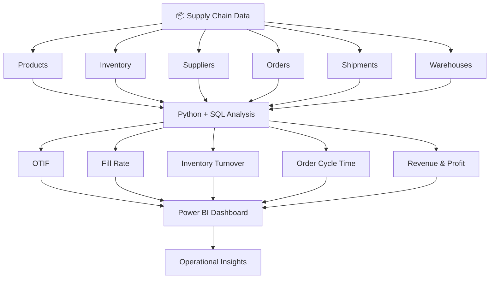
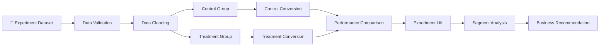
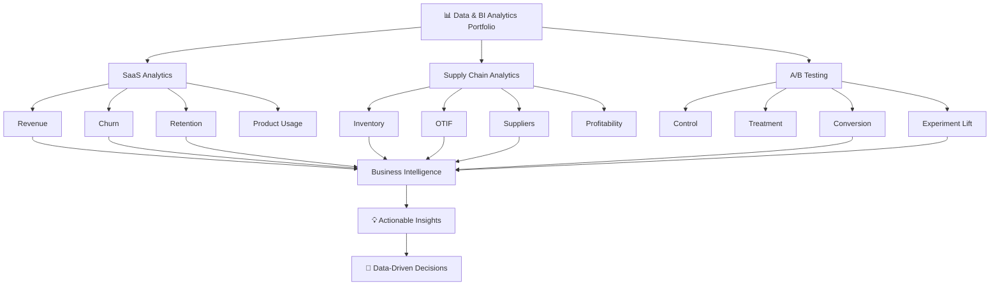

````markdown
<div align="center">

# 📊 Shil Gawande — Data & BI Analytics Portfolio

### Data Analyst • BI Analyst • SQL • Python • Power BI • Excel

**Transforming raw business data into measurable insights, interactive dashboards, and data-driven decisions.**

<br>

[](https://github.com/gawandeshil03-ops)
[](mailto:gawandeshil9@gmail.com)
[](tel:+919172937014)

📍 **Pune, Maharashtra, India**

</div>

---

# 👨‍💻 About Me

I am **Shil Gawande**, a 2026 engineering graduate building practical expertise in **Data Analytics and Business Intelligence**.

My work focuses on using **SQL, Python, Excel, Power BI, Pandas, and MySQL** to clean and validate data, analyze business performance, define meaningful KPIs, build dashboards, and translate analytical findings into business recommendations.

This portfolio demonstrates analytics across three different business areas:

- 📊 **SaaS & Business Operations Analytics**
- 🚚 **Supply Chain & Operations Analytics**
- 🧪 **Marketing Experimentation & A/B Testing**

Rather than focusing only on tools, each project follows a business-oriented analytical process:

> **Business Problem → Raw Data → Cleaning → SQL/Python Analysis → KPIs → Visualization → Insights → Decision**

---

# 🚀 Featured Analytics Projects

<table>
<tr>

<td width="33%" valign="top">

<h3 align="center">📊 SaaS Analytics</h3>

<p align="center">
<b>SaaS Business & IT Operations Analytics</b>
</p>

Customer, subscription, revenue, churn, retention, product-usage, and support analytics.

**Stack**

`Python` `SQL` `MySQL`  
`Pandas` `Power BI` `Excel`

<br>

<p align="center">
<a href="https://github.com/gawandeshil03-ops/Avacasa-Portfolio">

</a>
</p>

</td>

<td width="33%" valign="top">

<h3 align="center">🚚 SupplyIQ</h3>

<p align="center">
<b>Supply Chain Analytics</b>
</p>

Inventory, supplier, warehouse, shipment, OTIF, fill-rate, revenue, and profitability analytics.

**Stack**

`Python` `SQL`  
`Pandas` `Power BI`

<br>

<p align="center">
<a href="https://github.com/gawandeshil03-ops/SupplyIQ-Supply-Chain-Analytics">

</a>
</p>

</td>

<td width="33%" valign="top">

<h3 align="center">🧪 A/B Testing</h3>

<p align="center">
<b>Marketing Experiment Analytics</b>
</p>

Control-vs-treatment analysis, conversion measurement, experiment lift, segmentation, and business recommendations.

**Stack**

`Python` `SQL`  
`Pandas` `Experimentation`

<br>

<p align="center">
<a href="https://github.com/gawandeshil03-ops/AB-Testing-for-Marketing">

</a>
</p>

</td>

</tr>
</table>

---

# 🧭 Portfolio Architecture

```mermaid
flowchart LR

    A["📁 Raw Business Data"]

    A --> B["🧹 Data Cleaning & Validation"]

    B --> C["🐍 Python / Pandas"]
    B --> D["🗄️ SQL / MySQL"]

    C --> E["📊 Exploratory Analysis"]
    D --> E

    E --> F["🎯 KPI Development"]

    F --> G["📈 Power BI Dashboards"]
    F --> H["🧪 Experiment Analysis"]

    G --> I["💡 Business Insights"]
    H --> I

    I --> J["🎯 Data-Driven Decisions"]
````

---

# 01 — 📊 SaaS Business & IT Operations Analytics

### Business Problem

SaaS businesses generate information across customers, subscriptions, payments, product usage, and support operations.

Analyzing these sources together helps answer questions such as:

* How is revenue changing?
* Which customers are churning?
* How effectively are customers using the product?
* What factors may influence retention?
* How are support operations performing?
* Which KPIs should management monitor?

### Solution

The project combines SaaS business datasets into an analytical workflow using:

**Excel → Python/Pandas → MySQL/SQL → Power BI**

### Analysis Areas

* Customer analytics
* Subscription analytics
* Revenue performance
* Churn analysis
* Retention
* Product usage
* Support operations
* Customer behavior
* Business KPIs

### SQL Capabilities

* Joins
* CTEs
* Window functions
* Aggregations
* Filtering
* Customer-level analysis
* Revenue calculations
* KPI queries

### Business Value

The project demonstrates how fragmented SaaS operational data can be transformed into structured metrics and visual insights for business decision-making.

### Project Workflow

```mermaid
flowchart LR

A["Customers"] --> F["Data Integration"]
B["Subscriptions"] --> F
C["Payments"] --> F
D["Product Usage"] --> F
E["Support"] --> F

F --> G["Python Cleaning"]
G --> H["MySQL"]
H --> I["SQL Analytics"]

I --> J["Revenue"]
I --> K["Churn"]
I --> L["Retention"]
I --> M["Usage KPIs"]

J --> N["Power BI"]
K --> N
L --> N
M --> N

N --> O["Business Insights"]
```

### 🔗 Repository

[](https://github.com/gawandeshil03-ops/Avacasa-Portfolio)

---

# 02 — 🚚 SupplyIQ: Supply Chain Analytics

### Business Problem

Supply-chain performance depends on multiple connected areas:

* Inventory
* Orders
* Suppliers
* Warehouses
* Shipments
* Service levels
* Costs
* Revenue
* Profitability

Analyzing these areas separately makes it difficult to understand overall operational performance.

### Solution

SupplyIQ creates an analytical view of supply-chain operations using **Python, SQL, and Power BI**.

### Key KPIs

| KPI                       | Business Purpose                             |
| ------------------------- | -------------------------------------------- |
| **OTIF**                  | Measure orders delivered on time and in full |
| **Fill Rate**             | Measure ability to satisfy demand            |
| **Inventory Turnover**    | Evaluate inventory efficiency                |
| **Order Cycle Time**      | Monitor fulfillment speed                    |
| **Revenue**               | Track commercial performance                 |
| **Profitability**         | Understand financial contribution            |
| **Supplier Performance**  | Evaluate supplier reliability                |
| **Warehouse Performance** | Monitor operational efficiency               |

### Analysis Areas

* Inventory analysis
* Supplier analysis
* Warehouse performance
* Shipment analysis
* Order fulfillment
* Revenue analysis
* Profitability analysis
* Operational KPI monitoring

### SupplyIQ Analytical Flow



### Business Value

SupplyIQ demonstrates the ability to connect operational datasets, calculate supply-chain KPIs, identify performance patterns, and communicate results through BI reporting.

### 🔗 Repository

[](https://github.com/gawandeshil03-ops/SupplyIQ-Supply-Chain-Analytics)

---

# 03 — 🧪 A/B Testing for Marketing

### Business Problem

Businesses frequently need to decide whether a new campaign, strategy, feature, or customer experience performs better than the existing approach.

Making this decision from raw conversion numbers alone can be misleading.

### Solution

This project applies structured A/B experiment analysis to compare **control and treatment groups** and translate experiment results into business recommendations.

### Experiment Questions

* Does the treatment outperform the control?
* What is the conversion rate of each group?
* What is the observed experiment lift?
* Do different customer segments behave differently?
* Should the business adopt the tested change?

### Experiment Workflow



### Analysis Areas

* Control vs Treatment
* Conversion Rate
* Experiment Lift
* Segment Performance
* Campaign Analysis
* Data Validation
* Business Interpretation

### Business Value

The project demonstrates how experimentation can replace intuition with measurable evidence when evaluating marketing or product changes.

### 🔗 Repository

[](https://github.com/gawandeshil03-ops/AB-Testing-for-Marketing)

---

# 🔗 How The Three Projects Connect



---

# 🛠️ Technical Skills

| Category                  | Technologies / Skills                        |
| ------------------------- | -------------------------------------------- |
| **Programming**           | Python                                       |
| **Data Analysis**         | Pandas, NumPy, EDA, Data Cleaning            |
| **Database**              | SQL, MySQL                                   |
| **Advanced SQL**          | Joins, CTEs, Window Functions, Aggregations  |
| **Business Intelligence** | Power BI                                     |
| **Spreadsheet Analytics** | Excel                                        |
| **Analytics**             | KPI Analysis, Churn, Retention, Segmentation |
| **Experimentation**       | A/B Testing, Conversion Analysis             |
| **Tools**                 | Git, GitHub                                  |
| **Domains**               | SaaS, Supply Chain, Marketing Analytics      |

---

# 🔬 Analytics Toolkit

### 🐍 Python

`Pandas` • `NumPy` • `Data Cleaning` • `EDA` • `Transformation`

### 🗄️ SQL

`Joins` • `CTEs` • `Window Functions` • `Aggregations` • `KPI Queries`

### 📊 Power BI

`Dashboarding` • `KPI Reporting` • `Data Visualization` • `Business Insights`

### 📗 Excel

`Data Analysis` • `Data Validation` • `Business Reporting`

### 🧪 Experimentation

`A/B Testing` • `Control vs Treatment` • `Conversion Analysis` • `Experiment Lift`

---

# 🧩 Problem → Project → Capability

| Business Problem                      | Portfolio Project                       | Capability              |
| ------------------------------------- | --------------------------------------- | ----------------------- |
| Understand SaaS performance           | SaaS Business & IT Operations Analytics | SQL + Python + Power BI |
| Analyze revenue and customer behavior | SaaS Analytics                          | Business Analytics      |
| Identify churn and retention patterns | SaaS Analytics                          | Customer Analytics      |
| Improve supply-chain visibility       | SupplyIQ                                | Operational Analytics   |
| Monitor inventory and suppliers       | SupplyIQ                                | Supply Chain BI         |
| Measure OTIF and Fill Rate            | SupplyIQ                                | KPI Development         |
| Evaluate marketing changes            | A/B Testing                             | Experimentation         |
| Measure conversion improvement        | A/B Testing                             | Conversion Analytics    |
| Convert raw data into insights        | All Projects                            | Data Analysis           |
| Communicate findings                  | SaaS + SupplyIQ                         | Power BI                |

---

# 📊 Portfolio Coverage

```text
SQL                 ████████████████████
Python              ████████████████████
Power BI            ██████████████████
Excel               ███████████████
Data Cleaning       ████████████████████
Business KPIs       ████████████████████
SaaS Analytics      ██████████████████
Supply Chain        ██████████████████
A/B Testing         █████████████████
Business Insights   ████████████████████
```

---

# 🎯 Target Roles

This portfolio demonstrates skills relevant to entry-level opportunities including:

### Data & BI

* Data Analyst
* Junior Data Analyst
* BI Analyst
* Business Intelligence Analyst
* Analytics Intern

### Business & Product

* Business Analyst
* Product Analyst
* Operations Analyst

### Domain Analytics

* Supply Chain Analyst
* SaaS Analyst
* Marketing Analyst

---

# 💼 Recruiter Quick View

### What can I do?

I can work through an analytical problem from raw data to business recommendation:

```text
Raw Data
   ↓
Cleaning & Validation
   ↓
Python / Pandas
   ↓
SQL Analysis
   ↓
Business KPIs
   ↓
Power BI / Experiment Analysis
   ↓
Insights
   ↓
Business Recommendation
```

### What does this portfolio demonstrate?

**Technical**

* SQL querying
* Python data analysis
* Data cleaning
* Data validation
* Relational analysis
* Power BI dashboarding

**Analytical**

* KPI development
* Churn analysis
* Retention analysis
* Supply-chain analytics
* Experiment analysis
* Conversion analysis

**Business**

* Translating data into insights
* Identifying performance patterns
* Communicating analytical findings
* Supporting data-driven decisions

---

# 📂 Project Directory

| #  | Project                                     | Domain                      | Stack                               | Repository                                                                     |
| -- | ------------------------------------------- | --------------------------- | ----------------------------------- | ------------------------------------------------------------------------------ |
| 01 | **SaaS Business & IT Operations Analytics** | SaaS / Business             | Python, SQL, MySQL, Power BI, Excel | [Open →](https://github.com/gawandeshil03-ops/Avacasa-Portfolio)               |
| 02 | **SupplyIQ — Supply Chain Analytics**       | Supply Chain                | Python, SQL, Power BI               | [Open →](https://github.com/gawandeshil03-ops/SupplyIQ-Supply-Chain-Analytics) |
| 03 | **A/B Testing for Marketing**               | Marketing / Experimentation | Python, SQL, Pandas                 | [Open →](https://github.com/gawandeshil03-ops/AB-Testing-for-Marketing)        |

---

# 🎓 Education

### Bachelor of Engineering — Electronics & Telecommunication

**2022 – 2026**

Sant Gadge Baba Amravati University

---

# 🏅 Certifications

* **Tata — GenAI Data Analytics Job Simulation**
* **Tata — Data Visualization: Empowering Business with Effective Insights**
* **Deloitte Australia — Data Analytics Job Simulation**

---

# 💡 Core Knowledge

### Analytics

`Data Cleaning` • `EDA` • `Data Validation` • `Business Metrics` • `Dashboard Design`

### Computer Science

`OOP` • `DBMS` • `Data Structures & Algorithms` • `Operating Systems` • `Computer Networks`

---

# 🌐 Languages

**English** • **Hindi** • **Marathi**

---

# 👨‍💻 About Shil Gawande

I am a 2026 engineering graduate focused on building a career in **Data Analytics and Business Intelligence**.

My portfolio emphasizes practical problem solving across SaaS, supply-chain, and marketing datasets using **SQL, Python, Excel, and Power BI**.

I am interested in opportunities where I can combine analytical thinking, technical tools, and business understanding to help teams make better decisions from data.

---

# 📫 Contact

<div align="center">

### Shil Gawande

📍 **Pune, Maharashtra, India**

📱 **+91 9172937014**

📧 **[gawandeshil9@gmail.com](mailto:gawandeshil9@gmail.com)**

💻 **GitHub:** [github.com/gawandeshil03-ops](https://github.com/gawandeshil03-ops)

<br>

[](mailto:gawandeshil9@gmail.com)
[](https://github.com/gawandeshil03-ops)

</div>

---

<div align="center">

# 📊 From Data to Decisions

### SQL • Python • Power BI • Excel • Business Analytics

**SaaS Analytics • Supply Chain Analytics • Experimentation**

<br>

⭐ **Explore the projects above to see the complete analytical workflows.**

</div>
```

Save this as **`README.md`** in the main portfolio repository. The three large **Open Project** buttons will take recruiters directly to your individual repositories.
